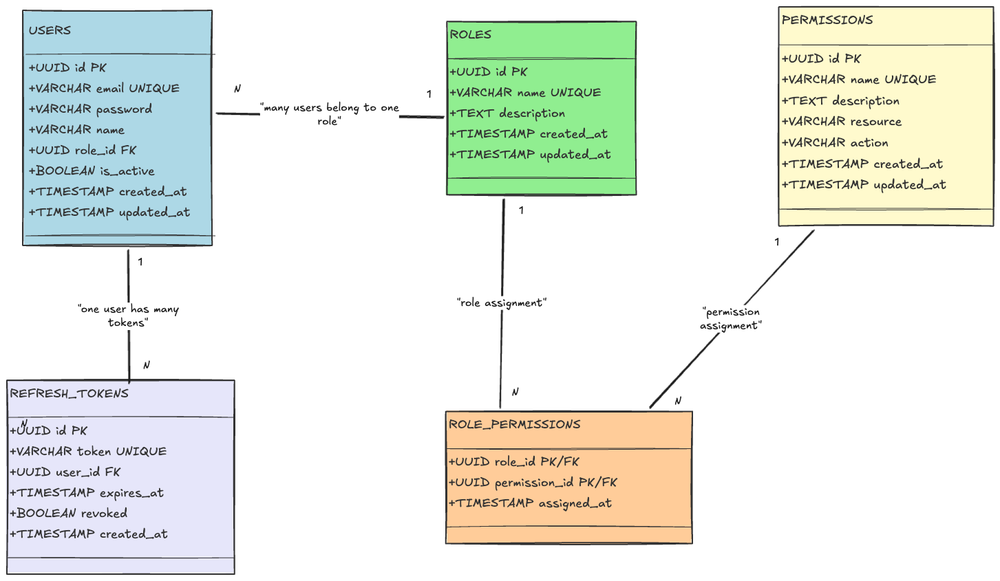

# 🔐 Auth System - NestJS RBAC

Authentication and authorization system based on RBAC (Role-Based Access Control) developed with NestJS, TypeORM and PostgreSQL.

## 📋 Features

- ✅ JWT Authentication with Access and Refresh Tokens
- ✅ Complete RBAC system (Roles and Permissions)
- ✅ Secure password hashing with scrypt
- ✅ Refresh token rotation
- ✅ Global authentication and authorization guards
- ✅ Data validation with class-validator
- ✅ Automatic migrations and seeds
- ✅ Docker Compose for development

## 🏗️ Architecture

The system follows the RBAC (Role-Based Access Control) pattern.

### Main Entities

- **Users:** System users with JWT authentication
- **Roles:** Roles/functions that group permissions
- **Permissions:** Granular permissions (resource:action)
- **Role_Permissions:** Many-to-many junction table
- **Refresh_Tokens:** Refresh tokens stored in database

### Architecture Diagram




## 🚀 Getting Started

### Prerequisites

- **Docker and Docker Compose**
- Make

### Installation

1. Clone the repository:
```bash
git clone https://github.com/lmiguelcardoso/auth-system.git
cd auth-system
```

2. Start the Docker containers:
```bash
make up
# or
docker-compose up -d
```

3. Configure the database (migrations + seed):
```bash
make setup
# or
npm run migration:run && npm run seed
```

The API will be available at: `http://localhost:3000`

## 📚 API Endpoints

### Authentication (`/auth`)

| Method | Endpoint | Description | Access |
|--------|----------|-------------|--------|
| POST | `/auth/register` | Register new user | Public |
| POST | `/auth/login` | Login and get tokens | Public |
| POST | `/auth/refresh` | Refresh access token | Public |
| POST | `/auth/logout` | Invalidate refresh tokens | Authenticated |
| GET | `/auth/me` | Logged user profile | Authenticated |

### Users (`/users`)

| Method | Endpoint | Description | Permission |
|--------|----------|-------------|------------|
| GET | `/users` | List users | `users:read` |
| GET | `/users/:id` | Get user | `users:read` |
| POST | `/users` | Create user | `users:create` |
| PATCH | `/users/:id` | Update user | `users:update` |
| DELETE | `/users/:id` | Delete user | `users:delete` |

### Roles (`/roles`)

| Method | Endpoint | Description | Permission |
|--------|----------|-------------|------------|
| GET | `/roles` | List roles | `roles:read` |
| POST | `/roles` | Create role | `roles:create` |
| GET | `/roles/:id` | Get role | `roles:read` |
| PATCH | `/roles/:id` | Update role | `roles:update` |
| DELETE | `/roles/:id` | Delete role | `roles:delete` |
| POST | `/roles/:id/permissions` | Assign permission | `roles:assign-permission` |
| DELETE | `/roles/:id/permissions/:permId` | Remove permission | `roles:assign-permission` |

### Permissions (`/permissions`)

| Method | Endpoint | Description | Permission |
|--------|----------|-------------|------------|
| GET | `/permissions` | List permissions | `permissions:read` |
| POST | `/permissions` | Create permission | `permissions:create` |
| GET | `/permissions/:id` | Get permission | `permissions:read` |
| PATCH | `/permissions/:id` | Update permission | `permissions:update` |
| DELETE | `/permissions/:id` | Delete permission | `permissions:delete` |

## 🔑 Default Credentials

After running the seeds, an admin user is created:

- **Email:** `admin@admin.com`
- **Password:** `admin123`
- **Role:** `admin` (with all permissions)

## 🛠️ Make Commands

```bash
make help       # Show all available commands
make up         # Start Docker containers
make down       # Stop Docker containers
make restart    # Restart containers
make logs       # View logs
make db-shell   # Access PostgreSQL shell
make setup      # Run migrations and seed (initial setup)
make migrate    # Run migrations only
make seed       # Run seed only
make dev        # Start in development mode
make build      # Build the application
make lint       # Run linter
make test       # Run tests
make clean      # Remove containers and volumes
```

## 🔒 Security

- **Passwords:** Hashed with scrypt (32-byte salt, 64-byte key)
- **JWT Access Token:** Expires in 15 minutes
- **JWT Refresh Token:** Expires in 7 days and stored in database
- **Token Rotation:** Refresh tokens are invalidated after use
- **Validation:** All inputs are validated with class-validator

## 🧪 Tests

```bash
# Unit tests
npm run test

# e2e tests
npm run test:e2e

# Coverage
npm run test:cov
```

## 📦 Project Structure

```
src/
├── auth/                 # Authentication module
│   ├── decorators/      # @Public, @Permissions, @CurrentUser
│   ├── dto/             # Authentication DTOs
│   ├── entities/        # RefreshToken entity
│   ├── guards/          # JwtAuthGuard, PermissionsGuard
│   ├── services/        # PasswordService
│   └── strategies/      # JwtStrategy
├── users/               # Users module
├── roles/               # Roles module
├── permissions/         # Permissions module
└── database/            # Configurations, migrations and seeds
```

## 🐳 Docker Services

- **app:** NestJS Application (port 3000)
- **postgres:** PostgreSQL 16 (port 5432)
- **pgadmin:** PgAdmin 4 (port 5050)

### Access PgAdmin

1. Access: `http://localhost:5050`
2. Login: `admin@admin.com` / `admin`
3. Add server:
   - Host: `postgres`
   - Port: `5432`
   - Username: `auth_user`
   - Password: `auth_password`
